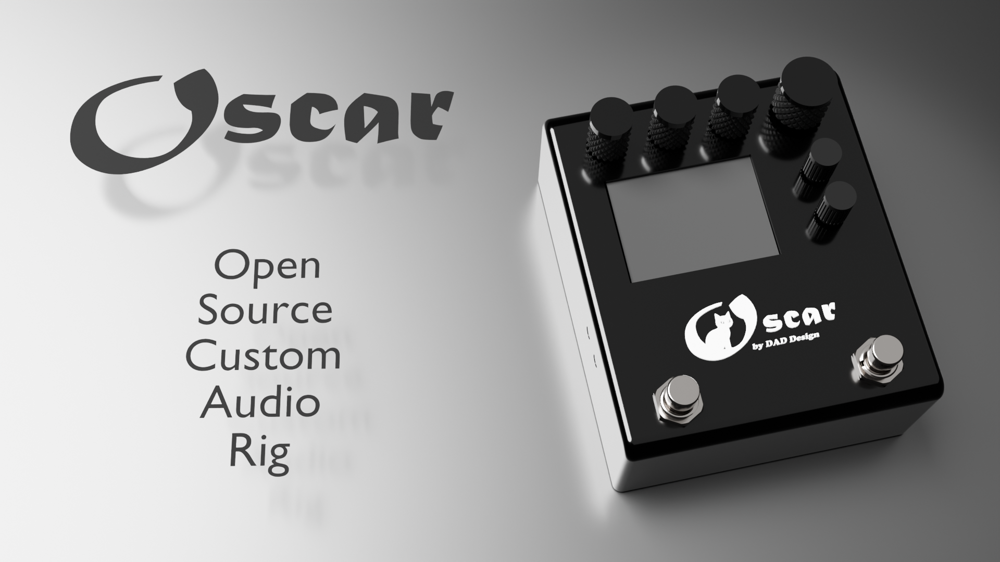

[](LICENSE)


---

---
# OSCAR — Open Source Custom Audio Rig

**OSCAR** is an open-source hardware and software framework designed to provide a solid foundation for developing digital guitar-effect pedals.  
The goal of the project is to **simplify** and **speed up** the creation of audio effects by offering all the essential building blocks: audio codec management, hardware interfaces (QSPI, SDRAM, GPIO, encoders, footswitch), audio pipeline, parameters, embedded UI, and a modular software architecture ready to use.  

Designed as a flexible and scalable platform, OSCAR allows developers to focus directly on creating effects (delay, chorus, tremolo, etc.) instead of dealing with low-level infrastructure.
It provides a **complete, reusable, and extensible** base for quickly building professional-quality digital effect pedals.
## 📥 Cloning the Repository  
OSCAR uses submodules for hardware and software components.  
To clone the complete project with all dependencies:
```bash
git clone --recurse-submodules https://github.com/DADDesign-Projects/OSCAR_P01A01
```
## 🔧 Specifications — Version **P01A01**
### 🧠 Processor Board  
OSCAR is built around the **“PROC_01” processor board**, described in the GitHub repository:  
https://github.com/DADDesign-Projects/OSCAR_PROC_01
  * Microcontroller STM32H743:
    * High-performance ARM Cortex-M7 MCU, 480 MHz frequency, 2MB Flash memory, 1MB RAM
 * Flash Memory 2* W25Q128
   * 32 Moctet, Double mode 8 bits SPI, 120 Mhz
* SDRAM Memory IS42S16320
  * 64 Moctet, 200 Mhz
* USB OTG FS
  * CDC Virtual port COM
  * UDP DownLoad Firmware Update
  * MIDI / USB
* UI
  * 4 Encoders
  * 2 Switchs
  * TFT
    * 2.4 inch, SPI inteface
* MIDI
  * UART TRS Midi in
  * USB MIDI
* Programming/Debugging
  * STLink serial port
  * USB UDP protocol.

### 🎚 Audio Board  
The **“AUDIO_01” audio board** is documented in the following repository:  
https://github.com/DADDesign-Projects/OSCAR_AUDIO_01
  * Audio Codec
    * PCM3060: 24-bit stereo audio codec
    * Sampling Rate: 48 kHz
  * Analog Dry Channel
    * PGA2310: Stereo volume controller
    * Analog dry path for unaffected signal
  * Power Supply
    * Isolated Power: Separate analog and digital domains
    * Input Voltage: 12V DC
    * Low Noise Regulation: Multiple LDO regulators 

### 💻 Software  
The OSCAR software stack is built around the **DAD_FORGE** framework (Framework for Open and Resourceful Guitar Effects):  
https://github.com/DADDesign-Projects/DAD_FORGE  
DAD_FORGE provides the complete software architecture: audio processing pipeline (DSP), parameter system, embedded user interface, preset management, and integration with OSCAR hardware modules.  
It enables developers to quickly create modular and professional-grade audio effects (delay, chorus, tremolo, etc.) without having to rebuild the entire infrastructure from scratch.

## 🛠 Implementation & Development Setup
### 💻 Software Development  
OSCAR’s firmware is developed using **STM32CubeIDE**, the official IDE from STMicroelectronics for STM32 microcontrollers.  
It provides the compiler, debugger, HAL libraries, CubeMX configuration, and all tools required to build the firmware.
Download STM32CubeIDE here:  
https://www.st.com/en/development-tools/stm32cubeide.html

### 🧩 Hardware Development  
All hardware for OSCAR (processor board, audio board, connectors, etc.) is designed using **KiCad 9.0**, a fully open-source EDA suite.
Download KiCad 9.0 here:  
https://www.kicad.org/

### 🛠 Mechanical Design  
Enclosures, mechanical parts, knobs, and button components for OSCAR are developed using **FreeCAD**, an open-source parametric 3D CAD tool.
Download FreeCAD here:  
https://www.freecad.org/


